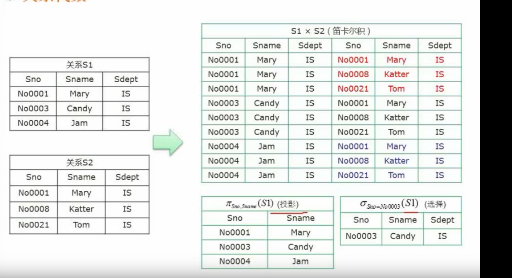
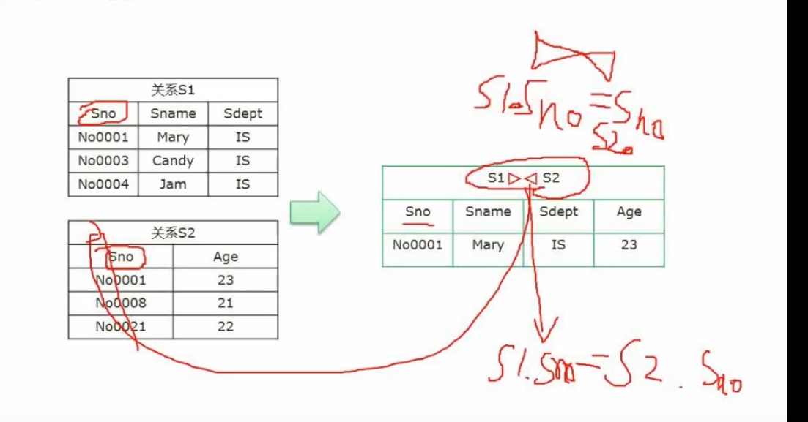

#### 1：三级模式-两级映射

+ 内模式（物理文件）
+ 概念模式（表）
+ 外模式（视图）


#### 2：数据库设计

 ```mermaid
graph TD
A[需求分析] -->B[概念设计] -->C[逻辑结构设计] -->D[物理设计]

 ```

+ 需求分析的产物：数据流图、数据字典
+ 概念设计的产物：ER模型
+ 逻辑结构设计的产物：关系模式（表）
+ 物理设计的产物：DBMS特性、硬件、OS特性


#### 3：ER模型

+ 方框表示实体、椭圆表示属性、菱形表示关系
+ 集成方法
  + 多个局部ER图一次集成
  + 逐步集成
+ 冲突
  + 属性冲突：属性域、属性值
  + 命名冲突：同名异义、异名同义
  + 结构冲突


#### 4：关系代数

+ 并∪
+ 交∩
+ 差-
+ 笛卡尔积×
+ 投影：$\pi$ ，select 列
+ 选择：$\sigma$ ，where 条件
+ 连接：会将$S_1$​、$S_2$​​ 都有的字段只保留一个






#### 5：规范化理论-函数依赖

+ 部分函数依赖

  ```mermaid
  graph LR
  A(A) --> C(C)
  B(B) --> C(C)
  ```

  

+ 传递函数依赖

  ```mermaid
  graph LR
  A(A) --> B(B) -->C(C)
  ```


#### 6：规范化理论-价值与用途

解决数据冗余、更新异常、插入异常、删除异常


#### 7：规范化理论-键

+ 超键：可以唯一标识一条数据，可能存在冗余属性
+ 候选键：在超键的基础上，消除超键的冗余属性
+ 主键：在候选键中任选一个；候选键有多个，主键只有一个
+ 外键：其他关系的主键


#### 8：规范化理论-求候选键

使用图示法：

+ 将关系模式用`有向图`表示
+ 照出入度为0的属性节点，尝试遍历这个图
+ 如果无法遍历成功，则尝试使用中间节点


#### 9：规范化理论-范式（★）

主要涉及的题型有函数依赖和候选键求解

+ 1NF：属性值都是不可分割的原子值，正常都是实现了的
+ 2NF：消除了非主属性对候选键的`部分依赖`，即必须是完整的候选键才能确定非主属性，不存在候选键的部分属性可以确定其他非主属性。
+ 3NF：消除了非主属性对候选键的`传递依赖`。


#### 10：规范化理论-模式分解（★）

+ 第一行顺序写原有模式的属性
+ 第一列顺序写分解后的模式
+ 行列交汇处，如果分解后的模式中有原有模式的属性，记为a，否则记为b
+ 根据函数依赖，尝试将b节点推导为a
+ 只有有一行全为a，则为无损分解


#### 11：并发控制

+ 事务：ACID
+ 并发产生的问题
+ 封锁协议
+ 死锁问题（★）


#### 12：数据库完整性约束

+ 实体完整性约束（主键）
+ 参照完成性约束（外键）
+ 用户自定义完整性约束
+ 触发器


#### 13：数据库安全

+ 用户标识和鉴定：密码
+ 存取控制：授权
+ 密码存储和传输
+ 视图的保护
+ 审计：日志、操作日志


#### 14：数据库的备份

+ 冷备份
+ 热备份


+ 完全备份:备份所有数据
+ 差量备份：仅备份上一次完全备份之后变化的数据
+ 增量备份：备份上一次备份之后的数据

