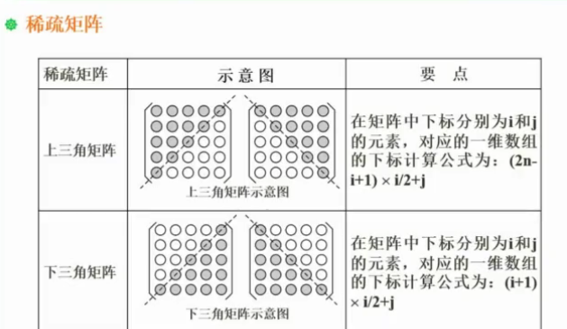
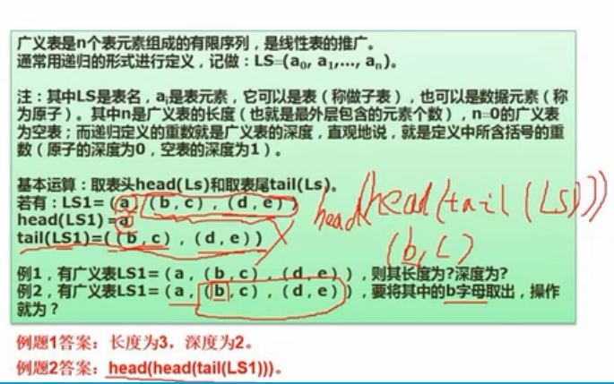

[TOC]


#### 1：数组

+ 一维数组a[n]

  ```
  a[i]的存储地址为：a+i*len
  ```

+ 二维数组a\[m\]\[n\]

  ```
  a[i][j]的存储地址（按行存储）：a+(i×n+j)×len
  a[i][j]的存储地址（按列存储）：a+(j×m+i)×len
  ```

> 例题已知5行5列的二维数组a中的各元素占两个字节，求元素a\[2\]\[3\]
>
> 答案：a+（2*5+3）\*2

#### 2：稀疏矩阵



计算稀疏矩阵对应的一维数组的坐标：代入法

+ 上三角矩阵：（2n-i+1）× i/2 + j
+ 下三角矩阵：（i+1）× i/2 + j


#### 3：线性表

+ 顺序表：一维数组

+ 链表

  + 单链表
  + 循环链表
  + 双向链表

+ 队列：先进先出

  + 循环队列

    ```
    队空条件：head=tail
    
    队满条件：(tail + 1 ) % size = head
    ```

    

+ 栈：先进后出


#### 4：广义表

基本运算

+ 取表头 第一个元素
+ 取表尾 表尾指除了表头的所有元素



#### 5：树与二叉树

+ 节点的度：节点拥有的孩子节点数(只算左右节点，最多为2，叶子节点 的度为0)
+ 树的度：一个树中，所有节点最高的度
+ 树的层次：最低为1


#### 6：特殊二叉树

一些概念：

+ 满二叉树：整棵树无缺失的节点

+ 完全二叉树：除了最底下一层，其他层都是满的，且要求最底下一层节点从左到右

+ 非完全二叉树：除了最底下一层，其他层都是满的，最底下一层节点非从左到右（中间有空节点，或左侧无节点）

  

重要特性：

+ 1、在二叉树的第i层上最多有$2^{i-1}$个节点（i$\geq$ 1）
+ 2、深度为k的树最多有个$2^{k}-1$个节点（k$\geq$ 1）
+ 3、对于任意二叉树，如果其叶子节点数量为$n_0$，度为2的节点数量为$n_2$，则$n_0 = n_2 + 1$


#### 7：二叉树遍历

+ 前序遍历：根左右
+ 中序遍历：左根右
+ 后序遍历：右左根
+ 层次遍历

反向构造二叉树：必须有前序遍历，才能反向构造


#### 8：树转二叉树

原则：

+ 孩子节点转换为左子树节点
+ 兄弟节点转换为右孩子节点


#### 9：查找二叉树（二叉排序树）

左孩子小于根，右孩子大于根


#### 10：最优二叉树（哈夫曼树）

经常用于数据压缩，属于无损压缩

目标：让一棵树的带权路径最小

构造步骤：

+ 先选出两个最小的权值构成一棵树，父节点P的权值为两个子节点权值相加
+ 从P节点和剩下的其他节点中继续选出两个最小节点构造树，如此反复


#### 11：线索二叉树

有虚线将节点串起来，方便遍历


#### 12：平衡二叉树

定义：

+ 任意节点的左右子树的深度相差不超过1
+ 节点的平衡度只能为-1，0，或1（左右子树的深度差）


#### 13：图

概念：

+ 无向图
+ 有向图

+ 完全图

  ```
  在无向图中，若每对顶点之间都有一条边相连，则为完全图
  在有向图中，若每对顶点之间都有二条边相连，则为完全图
  ```

存储方式：

+ 邻接矩阵，对于无向图而言，具有对称性

+ 邻接表

  ```
  1：把每个顶点的邻接顶点用链表表示出来
  2：用一维数组再存储每个链表的头指针（图的顶点）
  ```

图的遍历：

+ 深度优先（类似于树的前序遍历）

  + 访问出发节点V

  + 依次从V出发搜索V的任意一个邻接节点W‘

  + 若W未被访问过，则从该节点出发继续深度优先遍历

+ 广度优先
  
+ 访问出发节点V
  + 然后访问与顶点V的全部未访问的邻接节点W,X,Y...
  + 然后再依次访问W,X,Y...节点的邻接未访问的节点


#### 14：拓扑排序

用有向边表示活动之间开始的依赖关系，这种有向图称为用顶点表示的活动网络，简称为AOV网络。


#### 15：图的最小生成树（若边小于等于节点，则为树）

+ 普利姆算法

  ```
  1：任选一个顶点为红点，其他节点为蓝点
  2：从红点集中找到蓝点集路径最短的点的路径（不能形成环路）
  ```

+ 克鲁斯卡尔算法

  ```
  选边
  ```

  

 

  