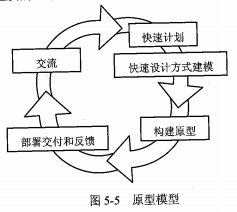
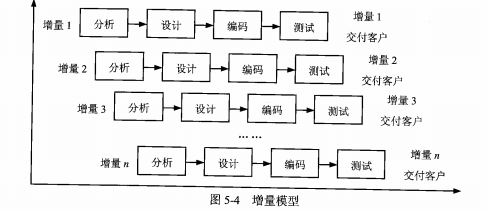

### 一：软件生命周期

#### 1：软件生命周期的划分

1. 可行性分析与项目开发计划
2. 需求分析
3. 概要设计
4. 详细设计
5. 编码
6. 测试
7. 维护

#### 2：各阶段的任务

### 二：软件开发模型

#### 3:模型分类
+ 瀑布模型

  > 将软件生存周期中的各个活动规定为依线性顺序连接的若干阶段的模型，由前至后，相互衔接的固定次序，如同瀑布流水逐级下落

  

+ 原型模型

  

+ 演化模型：典型的演化模型有原型模型和螺旋模型

+ 喷泉模型

  

  

+ 增量模型

  > 增量模型融合了瀑布模型的基本成分和原型实现的迭代特征，它假设可以将需求分段为一系列增量产品，每一增量可以分别开发。该模型采用随着日程时间的进展而交错的线性序列，每一个线性序列产生软件的一个可发布的"增量"

  

+ 螺旋模型

  

### 三：软件开发方法论

#### 4：方法分类
+ 结构化开发
+ 面向对象开发
+ 模块设计

#### 5：开发阶段

#### 6：内聚与耦合

### 四：软件测试

#### 7：白盒测试
+ 语句覆盖
+ 判定覆盖
+ 条件覆盖
+ 判定/条件覆盖
+ 组合条件覆盖
+ 路劲覆盖

#### 8：黑盒测试
+ 等价类划分
+ 边界值分析

### 五：软件维护
#### 9：软件维护分类
+ 改正性维护
+ 完善性维护
+ 适应性维护
+ 预防性维护

### 六：软件质量管理

#### 10：ISO/IEC 9126

#### 11：McCall

#### 12：软件复杂性的概念及技术

### 七；软件过程改进
#### 13：软件能力成熟度模型

#### 14：极限编程

### 八：软件项目管理
#### 15：甘特图

#### 16：PERT图

#### 17：图求关键路径

#### 18：风险管理

