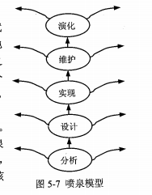
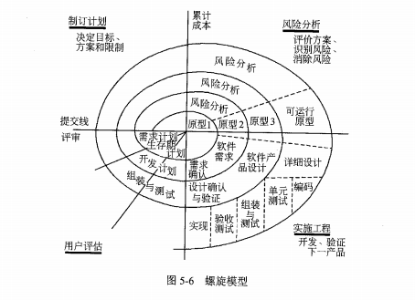
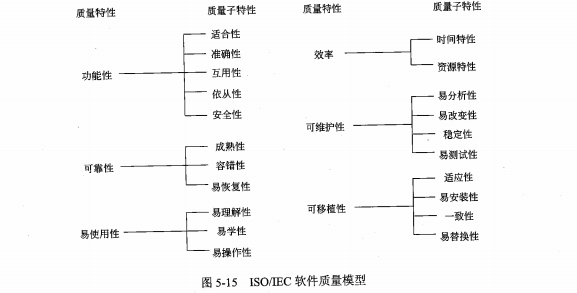
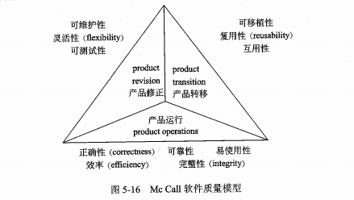
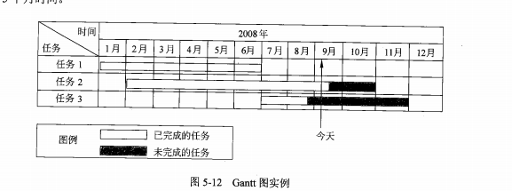
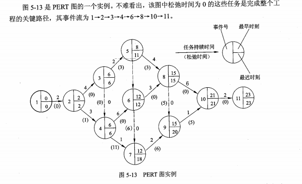

### 一：软件生命周期

#### 1：软件生命周期的划分

1. 可行性分析与项目开发计划
2. 需求分析
3. 概要设计
4. 详细设计
5. 编码
6. 测试
7. 维护

#### 2：各阶段的任务

### 二：软件开发模型

#### 3:模型分类
+ 瀑布模型

  > 将软件生存周期中的各个活动规定为依线性顺序连接的若干阶段的模型，由前至后，相互衔接的固定次序，如同瀑布流水逐级下落

  

+ 原型模型

  

+ 演化模型：典型的演化模型有原型模型和螺旋模型

+ 喷泉模型

  

  

+ 增量模型

  > 增量模型融合了瀑布模型的基本成分和原型实现的迭代特征，它假设可以将需求分段为一系列增量产品，每一增量可以分别开发。该模型采用随着日程时间的进展而交错的线性序列，每一个线性序列产生软件的一个可发布的"增量"

  

+ 螺旋模型

  

### 三：软件开发方法论

#### 4：方法分类
+ 结构化开发
+ 面向对象开发
+ 模块设计

#### 5：开发阶段

#### 6：内聚与耦合

### 四：软件测试

#### 7：白盒测试
+ 语句覆盖
+ 判定覆盖
+ 条件覆盖
+ 判定/条件覆盖
+ 组合条件覆盖
+ 路劲覆盖

#### 8：黑盒测试
+ 等价类划分

  

+ 边界值分析

### 五：软件维护
#### 9：软件维护分类
+ 改正性维护
+ 完善性维护
+ 适应性维护
+ 预防性维护

### 六：软件质量管理

#### 10：ISO/IEC 9126

#### 11：McCall

#### 12：软件复杂性的概念及技术

​	McCabe度量法:环路复杂度：边数-节点数+2

### 七；软件过程改进
#### 13：软件能力成熟度模型

CMM 将软件过程改进分为以下 5 个成熟度级别。

1）初始级（Iitial）

软件过程的特点是杂乱无章，有时甚至很混乱，几乎没有明确定义的步骤，项目的成功完全依赖个人的努力和英雄式核心人物的作用。

2）可重复级（Repeatable）

建立了基本的项目管理过程和实践来跟踪项日费用、进度和功能特性，有必要的过程准则来重复以前在同类项目中的成功。

3）己定义级（Defined）

管理和工程两方面的软件过程已经文档化、标准化，并综合成整个软件开发组织的标准软

件过程。所有项目都采用根据实际情况修改后得到的标准软件过程来开发和维护软件。

4）己管理级（Managed）

制定了软件过程和产品质量的详细度量标准。软件过程的产品质量都被开发组织的成员所理解和控制。

5）优化级（Optimized）

加强了定量分析，通过来自过程质量反馈和来自新观念、新技术的反馈使过程能不断持续地改进。

#### 14：极限编程

>  极限编程是一种轻量级（敏捷）、高效、低风险、柔性、可预测的、科学的软件开发方式。

- 4大价值观： 沟通、简单性、反馈和勇气。

-  5个原则：快速反馈、简单性假设、逐步修改、提倡更改和优质工作。

- > 12个最佳实践：
  >
  > 计划游戏（快速制定计划、随着细节的不断变化而完善）、小型发布（系统的设计要能够尽可能早地交付）、
  >
  > 隐喻（找到合适的比喻传达信息）、
  >
  > 简单设计（只处理当前的需求，使设计保持简单）、
  >
  > 测试先行（先写测试代码，然后再编写程序）、
  >
  > 重构（重新审视需求和设计，重新明确地描述它们以符合新的和现有的需求）、
  >
  > 结队编程、
  >
  > 集体代码所有制、
  >
  > 持续集成（可以按日甚至按小时为客户提供可运行的版本）、
  >
  > 每周工作40个小时、
  >
  > 现场客户和编码标准。

​            

### 八：软件项目管理
#### 15：甘特图

能清晰地描述各个任务之间的并行关系

不能够明确表达任务之间的依赖关系

#### 16：PERT图

能够明确表达任务之间的依赖关系

不能清晰地描述各个任务之间的并行关系

#### 17：图求关键路径

关键路径：用时最长的路径，其下的节点冗余时间为0

#### 18：风险管理

